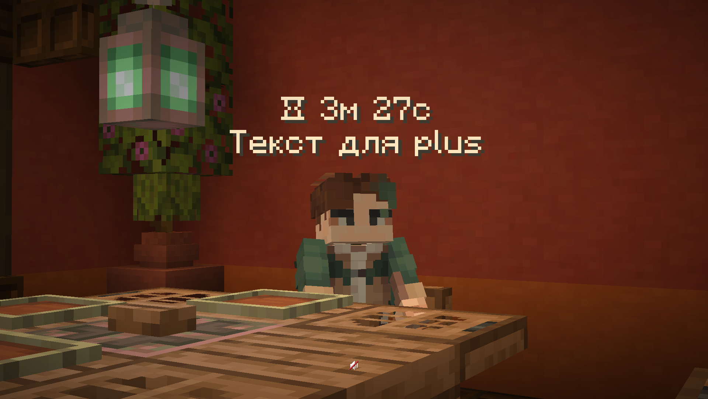

# AFK

***

Чтобы встать в afk, вы должны стоять неподвижно 5 минут или просто написать команду. Когда вы становитесь в afk, над вами появляется таймер с временем, сколько вы уже уже стоите, и ваш ник в табе становится серым цветом.

<figure><figcaption>
Таймера с текстом во время afk
</figcaption></figure> <figure><figcaption>
Серый ник в табе во время afk
</figcaption></figure>

## Использования:


* <mark style="color:$primary;">`/afk`</mark>  — Что бы встать в afk
* <mark style="color:$primary;">`/afk [текст]`</mark> — Что бы поставить текст под таймером, но это возможность доступна для подписки <mark style="color:$primary;">**PLUS**</mark>
* <mark style="color:$primary;">`/afk Очистить`</mark> — Что бы очистить текст под таймером, но это возможность доступна для подписки <mark style="color:$primary;">**PLUS**</mark>

