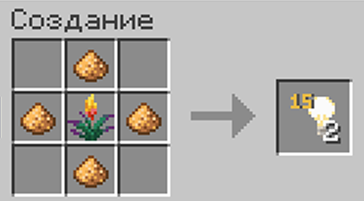

# Блоки света

***

Блок света — это невидимый блок, излучающий свет заданной яркости. Он идеально подходит для освещения построек, скрытых проходов и декораций без необходимости ставить факелы, фонари или лампы.

### Крафт:

<figure><figcaption>
Крафт блока света
</figcaption></figure>

Для крафта потребуется **1 цветок факельника** и **4 светокаменной пыли**. На выходе вы получите сразу **2 блока света**.

***

### Использование и регулировка яркости:

<figure><figcaption>
Пример использования блока света
</figcaption></figure>

1. **Размещение:** поставьте блок света в любое нужное место (блок невидим, сквозь него можно свободно проходить).
2. **Отображение:** пока вы держите блок света в руках, вокруг всех размещённых поблизости блоков света отображается визуальная рамка с их текущим уровнем яркости.
3. **Регулировка уровня света:**
   * Возьмите блок света в основную руку.
   * Направьте взгляд на размещённый блок света.
   * **Зажмите Shift** и крутите **колёсико мыши** (переключая соседние слоты хотбара):
     * Вращение в одну сторону **увеличивает** яркость (вплоть до 15).
     * Вращение в другую сторону **уменьшает** яркость (до 1).
   * При каждом шаге воспроизводится щелчок медной лампы, а текущий уровень отображается в панели действий.
4. **Снятие блока:** нажмите **ЛКМ** по блоку света, и он выпадет обратно предметом в ваш инвентарь.
