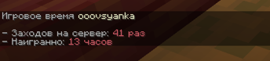

# Игровая статистика

***

Хотите узнать, сколько часов вы провели на просторах DeltaMine, или сравнить свою активность с другими жителями сервера? С помощью команды статистики можно мгновенно узнать проведённое в игре время и число входов.

### Что отображается в статистике:

<figure><figcaption>
Статистика игрока
</figcaption></figure>

* **Заходов на сервер:** общее число успешных авторизаций игрока.
* **Наиграно часов:** суммарное игровое время, проведённое на сервере.

Статистика ведётся непрерывно и доступна для любого игрока, даже если он сейчас офлайн.

***

### Использование:


* <mark style="color:$primary;">`/playtime`</mark> — Посмотреть свою игровую статистику
* <mark style="color:$primary;">`/playtime [Ник]`</mark> — Посмотреть статистику любого другого игрока

