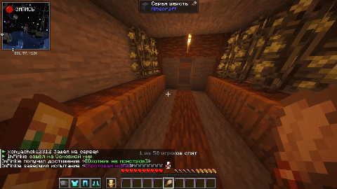
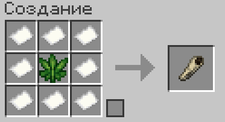

# Марихуана и косяк

***

На нашем сервере реализована собственная система выращивания запрещённых растений и создания самокруток. Пройдя путь от скрещивания семян и ухода за грядкой до сбора урожая специальным инструментом, вы сможете скрафтить свой персональный косяк.

***

## 1. Крафт семян

<figure><figcaption>
Крафт семян марихуаны
</figcaption></figure>

Чтобы начать культивацию, вам потребуется создать специальные семена на обычном верстаке.

Для крафта понадобятся:

* **1 шт.** — Семена пшеницы
* **1 шт.** — Сахар
* **1 шт.** — Костная мука

На выходе вы получите **2 шт.** семян.

***

## 2. Условия посадки и выращивание

<figure><figcaption></figcaption></figure>

Марихуана — капризное растение, требующее соблюдения строгих условий:

* **Грядка:** сажать семена можно только на **вспаханную землю (грядку)** нажатием **ПКМ**.
* **Влажность:** грядка обязательно должна быть максимально увлажнена (источник воды рядом).
* **Освещение:** уровень света около грядкой должен быть **не менее 10**.
* **Закрытое небо:** над растением должна быть крыша выше чем на 2 блока.


Куст проходит **3 стадии роста**, каждая из которых длится около **200 секунд** (полное созревание занимает около 10 минут). На второй стадии куст увеличивается до 2 блоков в высоту и покрывается частицами спор.



Если во время роста грядка высохнет, свет упадет ниже 10 или блок сверху будет перекрыт — куст погибнет и выпадет обратно в виде обычного семени!


***

## 3. Сбор урожая

<figure><figcaption></figcaption></figure>

Когда куст достигнет финальной 3-й стадии, наступает время сбора.


**Важно:** взрослый куст необходимо срезать исключительно **кистью**!


* **Сбор кистью:** вы получаете от **1 до 5 шт.** соцветий марихуаны и от **1 до 2 шт.** новых семян.
* **Сбор рукой или другим предметом:** куст сломается, марихуана будет безвозвратно утеряна, а вам вернется лишь 1 семя.

***

## 4. Крафт косяка

<figure><figcaption>
Крафт косяка
</figcaption></figure>

Собранная марихуана используется как сырье для изготовления косяка.

Для крафта понадобятся:

* **8 шт.** — Бумага
* **1 шт.** — Марихуана

***

## 5. Использование косяка (Курение)

<figure><figcaption></figcaption></figure>

Косяк не стакается (максимум 1 шт. в слоте) и рассчитан ровно на **15 затяжек**.

### Как курить:

1. Возьмите **косяк** в **основную руку**.
2. В **левую руку** обязательно положите **огниво**.
3. Нажмите **ПКМ** в воздух. Прозвучит щелчок зажигалки, и потратится 1 затяжка косяка (шкала прочности предмета уменьшится).

Через 3 секунды после затяжки персонаж начнёт выдыхать клубы густого дыма в направлении взгляда.

### Эффекты:

* **Тошнота:** накладывается после каждой затяжки. Чем больше затяжек вы сделали подряд, тем дольше длится эффект (по 5 секунд за каждую затяжку).
* **Тьма:** если вы сделаете **от 10 до 15 затяжек подряд**, персонаж получит глубокий эффект потемнения в глазах.
* Когда все 15 затяжек закончатся, косяк полностью исчезает.

***

## Использование:


* <mark style="color:$primary;">ПКМ семенами по мокрой грядке</mark> — Посадить куст
* <mark style="color:$primary;">ЛКМ кистью по зрелому кусту</mark> — Собрать урожай марихуаны
* <mark style="color:$primary;">ПКМ косяком (с огнивом в левой руке)</mark> — Сделать затяжку

