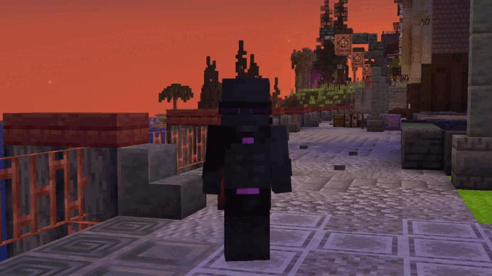

# Перемещение между мирами

***

На сервере DeltaMine мир разделён на два специализированных измерения. Такое разделение позволяет поддерживать идеальный TPS без лагов и обеспечивает комфортную игру как строителям, так и любителям масштабной автоматизации.



#### 🏛 Мир построек (Vanilla)

* Основной мир для городов, баз, магазинов и взаимодействия.
* Полная поддержка всех механик сервера.
* Ограничена работа тяжелых ферм для максимальной плавности игры.



#### 🌾 Мир ферм (WorldFarms)

* Специализированный мир для любых ресурсоёмких механизмов.
* Разрешены масштабные фермы мобов и ресурсов.
* Высокий спавнрейт.



***

### Правила перемещения:

<figure><figcaption></figcaption></figure>

Перемещение между мирами осуществляется по команде с красивым визуальным и звуковым эффектом телепортации:

* **Режим боя:** если вы получили урон или нанесли его сами, накладывается кулдаун на **7 секунд**. Во время боя перемещаться между мирами запрещено!
* Инвентарь, профиль и прогресс синхронизируются мгновенно.

***

### Использование:


<mark style="color:$primary;">`/worlds`</mark> — Переместиться в противоположный мир (из мира построек в мир ферм и наоборот)

