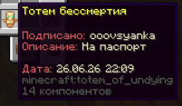

# Подпись предметов

***

Подписать предмет доступно только игрокам с подпиской <mark style="color:$primary;">**PLUS**</mark>

Подпись предмета можно использовать как договоры между игроками, так и просто для украшения.

<figure><figcaption>
Подпись с описанием
</figcaption></figure> <figure><figcaption>
Подпись без описания
</figcaption></figure>

## Использования:


* <mark style="color:$primary;">`/sign`</mark>  — Что бы подписать предмет без описание
* <mark style="color:$primary;">`/sign [Описание]`</mark>  — Что бы подписать предмет с описанием
* <mark style="color:$primary;">`/sign Удалить`</mark>  — Что бы убрать подпись


